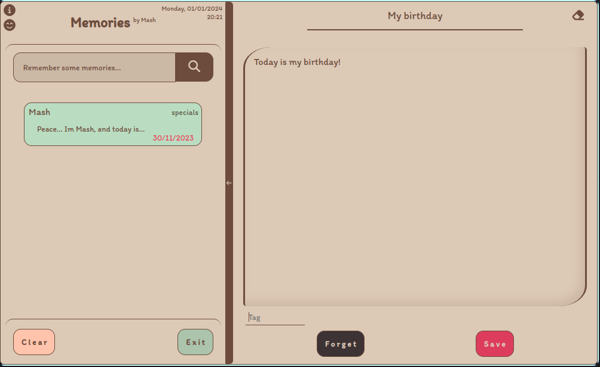

# Awesome Electron Notes App



> A beautiful Electron memories app.


## Features

- **Beautiful Interface:** A clean and intuitive user interface for a delightful memories recording experience.
- **Offline :** Access and edit your memories even without an internet connection.

## Installation

### Prerequisites

- [Node.js](https://nodejs.org/) installed
- [npm](https://www.npmjs.com/) (Node Package Manager)

### Steps

   ```bash
   git clone https://github.com/Mohamed-Abbas-Homani/Memories.git
   cd Memories
   npm install
   npm start
   ```
## License

This project is licensed under the MIT License - see the [LICENSE](LICENSE) file for details.
